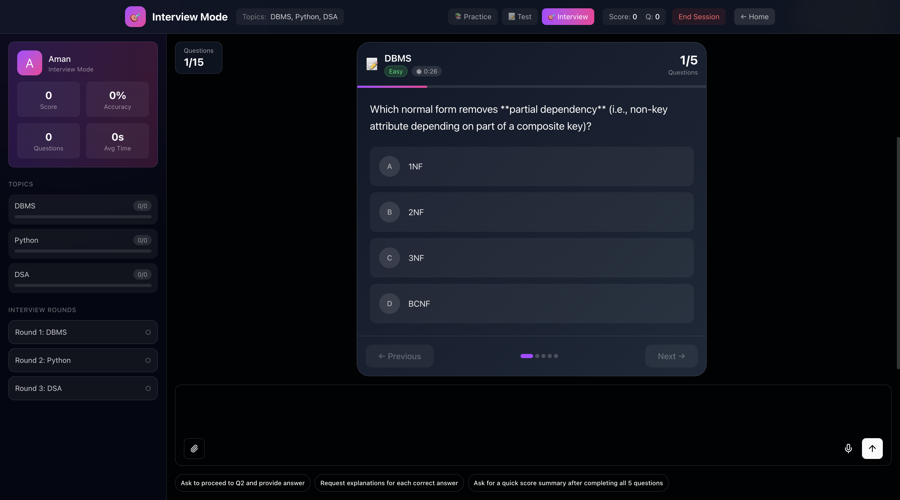
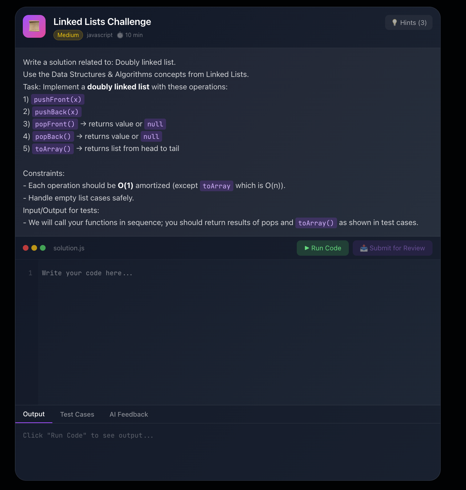

# AI Interview Platform

An intelligent, AI-powered interview and practice platform built with Next.js, Tambo AI, and modern web technologies. This platform enables dynamic technical interviews, practice sessions, and tests across multiple topics with real-time AI interaction.

## Live Demo

**Deployed Link**: [https://interview-ai-steel.vercel.app]

**Video Demo**: [https://interview-ai-steel.vercel.app/demo]

## Screenshots

<!-- Add screenshots here -->
<details>
<summary>Click to view screenshots</summary>

### Landing Page


### Interview Mode


### Theory Question


### MCQ Quiz


### Code Editor


</details>

## Features

### Core Features
- **Multiple Modes**: Practice, Test, and Interview modes with distinct behaviors
- **AI-Powered Questions**: Dynamic question generation across 7+ topics
- **Real-time AI Interaction**: Conversational interface with voice dictation support
- **Comprehensive Question Types**:
  - Multiple Choice Questions (MCQs)
  - Theory/Explanation Questions with markdown/code support
  - Live Code Editor with compilation
  - System Design Whiteboard
  - Match the Following
- **Performance Tracking**: Real-time score updates, topic analysis, and insights
- **Session Management**: Persistent sessions with localStorage

### Interview Integrity Features
- **Fullscreen Mode**: Enforced during interviews
- **Tab Switch Detection**: Monitors and warns on tab changes
- **Auto-timeout**: Questions have time limits with automatic progression
- **ESC Key Detection**: Warns users who exit fullscreen

### UI/UX Features
- **Dark Theme**: Modern gradient-based dark UI
- **Animated Backgrounds**: Smooth blob animations
- **Responsive Design**: Works on desktop and laptop screens
- **Voice Input**: Dictation support for answering questions

## Tech Stack

| Technology | Purpose |
|------------|---------|
| **Next.js 14** | React framework with App Router |
| **TypeScript** | Type-safe development |
| **Tambo AI** | Generative UI and AI chat integration |
| **Tailwind CSS** | Utility-first styling |
| **NextAuth.js** | Authentication (Google OAuth) |
| **Zod** | Schema validation |
| **React Context** | State management |
| **localStorage** | Session persistence |

## Architecture

```
┌─────────────────────────────────────────────────────────────────┐
│                        Frontend (Next.js)                        │
├─────────────────────────────────────────────────────────────────┤
│  ┌─────────────┐  ┌─────────────┐  ┌─────────────┐              │
│  │   Practice  │  │    Test     │  │  Interview  │   Modes     │
│  └─────────────┘  └─────────────┘  └─────────────┘              │
├─────────────────────────────────────────────────────────────────┤
│  ┌─────────────────────────────────────────────────────────────┐│
│  │                    InterviewLayout                          ││
│  │  ┌──────────┐  ┌──────────────────────────┐  ┌───────────┐ ││
│  │  │ Sidebar  │  │    InterviewThread       │  │ Completion││ ││
│  │  │ (Scores) │  │  (AI Chat + Components)  │  │   Modal   ││ ││
│  │  └──────────┘  └──────────────────────────┘  └───────────┘ ││
│  └─────────────────────────────────────────────────────────────┘│
├─────────────────────────────────────────────────────────────────┤
│                     Context Providers                            │
│  ┌─────────────────┐  ┌────────────────────┐                    │
│  │ InterviewContext│  │   TamboProvider    │                    │
│  │ (Session Data)  │  │   (AI + Tools)     │                    │
│  └─────────────────┘  └────────────────────┘                    │
├─────────────────────────────────────────────────────────────────┤
│                      Tambo AI Backend                            │
│  ┌────────────┐  ┌────────────┐  ┌────────────┐                 │
│  │ Components │  │   Tools    │  │  Context   │                 │
│  │ (UI Gen)   │  │ (Actions)  │  │  Helpers   │                 │
│  └────────────┘  └────────────┘  └────────────┘                 │
└─────────────────────────────────────────────────────────────────┘
```

## How Context Is Managed

### 1. InterviewContext (Session State)
Manages the entire interview/practice session:

```typescript
interface InterviewSession {
  id: string;
  mode: "practice" | "test" | "interview";
  userName: string;
  selectedTopics: string[];
  questionsAttempted: number;
  questionsCorrect: number;
  totalScore: number;
  topicScores: Record<string, TopicScore>;
  attempts: QuestionAttempt[];
  strongTopics: string[];
  weakTopics: string[];
  averageTimePerQuestion: number;
  // ... more fields
}
```

### 2. TamboProvider Context Helpers
AI has access to session data through context helpers:

```typescript
contextHelpers={{
  getSessionContext: () => { /* Full session state */ },
  getPerformanceSummary: () => { /* User performance */ },
  getStrongTopics: () => session?.strongTopics,
  getWeakTopics: () => session?.weakTopics,
  getCurrentScore: () => `${session?.totalScore}/${session?.maxPossibleScore}`,
}}
```

### 3. Custom Events for Component Communication
Components communicate via custom events:

- `quiz-complete` - MCQ quiz finished
- `theory-score-recorded` - Theory question rated
- `theory-question-timeout` - Question time expired
- `fullscreen-exit-detected` - User exited fullscreen
- `interview-complete` - Interview finished

## Folder Structure

```
src/
├── app/                      # Next.js App Router pages
│   ├── page.tsx             # Landing page
│   ├── practice/            # Practice mode
│   ├── test/                # Test mode
│   ├── interview/           # Interview mode
│   ├── login/               # Authentication
│   └── api/auth/            # NextAuth API routes
│
├── components/
│   ├── shared/
│   │   └── interview-layout.tsx  # Main layout for all modes
│   │
│   ├── tambo/               # Tambo-integrated components
│   │   ├── interview-thread.tsx  # Main chat/thread component
│   │   ├── mcq-quiz.tsx          # Multiple choice quiz
│   │   ├── theory-question.tsx   # Theory question with timer
│   │   ├── code-editor.tsx       # Live code editor
│   │   ├── whiteboard.tsx        # System design canvas
│   │   ├── match-following.tsx   # Matching quiz
│   │   ├── stress-timer.tsx      # Countdown timer
│   │   ├── score-card.tsx        # Score display
│   │   └── message-*.tsx         # Chat UI components
│   │
│   └── ui/                  # Generic UI components
│
├── contexts/
│   ├── interview-context.tsx    # Session state management
│   └── session-context.tsx      # Auth session context
│
├── data/
│   └── topics/              # Topic configurations
│       ├── index.ts         # Topic exports
│       ├── types.ts         # Type definitions
│       ├── javascript.ts    # JavaScript topic config
│       ├── react.ts         # React topic config
│       ├── dbms.ts          # DBMS topic config
│       └── ...              # Other topics
│
├── lib/
│   ├── tambo.ts            # Tambo components & tools registration
│   ├── auth.ts             # NextAuth configuration
│   └── utils.ts            # Utility functions
│
└── services/               # External services
```

## Getting Started

### Prerequisites
- Node.js 18+
- npm or yarn
- Tambo API key (free at [tambo.co](https://tambo.co/dashboard))

### Installation

1. **Clone the repository**
   ```bash
   git clone <repository-url>
   cd my-tambo-app
   ```

2. **Install dependencies**
   ```bash
   npm install
   ```

3. **Set up environment variables**
   ```bash
   cp example.env.local .env.local
   ```
   
   Edit `.env.local`:
   ```env
   NEXT_PUBLIC_TAMBO_API_KEY=your_tambo_api_key
   
   # Optional: Google OAuth
   GOOGLE_CLIENT_ID=your_google_client_id
   GOOGLE_CLIENT_SECRET=your_google_client_secret
   NEXTAUTH_SECRET=your_nextauth_secret
   NEXTAUTH_URL=http://localhost:3000
   ```

4. **Run the development server**
   ```bash
   npm run dev
   ```

5. **Open in browser**
   Navigate to [http://localhost:3000](http://localhost:3000)

### Building for Production

```bash
npm run build
npm start
```

## How It Works

### 1. User Flow
1. User visits landing page and clicks "Start Practice/Test/Interview"
2. Selects topics and enters their name
3. AI greets user and begins asking questions
4. Questions are rendered as interactive components
5. User answers via chat or component interaction
6. AI rates answers and provides feedback
7. Scores update in real-time on sidebar
8. After 15 questions, completion modal shows results

### 2. AI Question Generation
The AI uses registered tools to generate questions:

```typescript
// AI can call these tools:
- getTopicInfo(topicId) → Get subtopics and concepts
- getDBMSQuiz() → Get MCQ questions for DBMS
- getCodingChallenge(topic) → Get coding problem
- rateTheoryAnswer(questionId, rating, feedback, topic)
```

### 3. Component Rendering
Tambo AI dynamically renders components based on context:

```typescript
// When AI wants to ask an MCQ:
{
  component: "MCQQuiz",
  props: {
    topic: "JavaScript",
    questions: [...],
    difficulty: "medium"
  }
}
```

### 4. Score Tracking
Scores flow through the system:

1. User completes MCQ → `quiz-complete` event
2. AI rates theory answer → `rateTheoryAnswer` tool → `theory-score-recorded` event
3. `InterviewContext.recordQuizResults()` updates session
4. Sidebar re-renders with new scores

## Contributing

We welcome contributions! Here's how to get started:

### Development Setup
1. Fork the repository
2. Create a feature branch: `git checkout -b feature/my-feature`
3. Make your changes
4. Run linting: `npm run lint`
5. Run build: `npm run build`
6. Commit: `git commit -m "Add my feature"`
7. Push: `git push origin feature/my-feature`
8. Open a Pull Request

### Areas for Contribution
- [ ] Add more topics (Kubernetes, AWS, etc.)
- [ ] Implement MongoDB persistence
- [ ] Add more question types
- [ ] Improve accessibility
- [ ] Add unit tests
- [ ] Mobile responsiveness
- [ ] Multiplayer interview mode

### Code Style
- TypeScript strict mode
- ESLint configuration in `eslint.config.mjs`
- Prettier for formatting
- Component files use PascalCase
- Utility files use camelCase

## Available Topics

| Topic | Subtopics | Question Types |
|-------|-----------|----------------|
| **JavaScript** | Closures, Promises, Event Loop, ES6+ | MCQ, Theory, Coding |
| **React** | Hooks, State, Components, Performance | MCQ, Theory, Coding |
| **DBMS** | SQL, Normalization, Transactions, Indexing | MCQ, Theory |
| **DSA** | Arrays, Trees, Graphs, Sorting, DP | MCQ, Theory, Coding |
| **Python** | OOP, Data Types, Libraries | MCQ, Theory, Coding |
| **System Design** | Architecture, Scalability, Caching | Theory, Whiteboard |
| **SQL** | Queries, Joins, Optimization | MCQ, Theory, Coding |

## API Reference

### Context Helpers (Available to AI)

| Helper | Returns | Description |
|--------|---------|-------------|
| `getSessionContext()` | string | Full session context for AI |
| `getPerformanceSummary()` | string | User's performance metrics |
| `getStrongTopics()` | string | Topics user excels at |
| `getWeakTopics()` | string | Topics needing improvement |
| `getCurrentScore()` | string | Current score (e.g., "15/20") |

### Custom Events

| Event | Payload | Description |
|-------|---------|-------------|
| `quiz-complete` | `{ topic, totalQuestions, correctAnswers, ... }` | MCQ quiz finished |
| `theory-score-recorded` | `{ topic, score, maxScore, timeSpent }` | Theory answer rated |
| `interview-complete` | `{ reason, finalScore }` | Interview session ended |

## License

MIT License - see [LICENSE](LICENSE) for details.

## Acknowledgments

- [Tambo AI](https://tambo.co) for the generative UI platform
- [Next.js](https://nextjs.org) for the React framework
- [Tailwind CSS](https://tailwindcss.com) for styling
- [Recharts](https://recharts.org) for data visualization

---

Built with love using Tambo AI and Next.js
